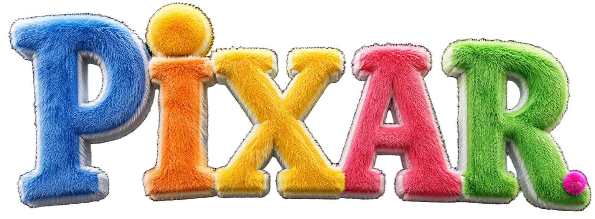

# 🎬 PIXAR — 3D Character Archive & Interactive Universe

<div align="center">



### 🌟 *An Immersive 3D Interactive Web Experience inspired by Pixar Animation Studios*

[](https://vitejs.dev/)
[](https://react.dev/)
[](https://www.typescriptlang.org/)
[](https://tailwindcss.com/)
[](https://motion.dev/)
[](https://github.com)

</div>

---

## 📖 Overview

**PIXAR 3D Character Archive** is a cutting-edge, GPU-accelerated web application that showcases Pixar-themed 3D characters through fluid animations, dynamic canvas scrubbing, proximity video playback, and responsive interactive storytelling.

Engineered with **React 19, TypeScript, Vite, Tailwind CSS, and Framer Motion**, this project delivers a high-performance 60/120 FPS experience across **Desktop (Windows/macOS), iPad/Tablets, and Mobile (Android/iOS)**.

---

## ✨ Key Features

### 🎮 1. Cinematic Intro & Sound Trigger
- **Audio Autoplay Unlock**: Interactive **START GAME** crystal frosted button that initializes the official Pixar orchestral intro sound cleanly across all browsers.
- **Fluffy Fur Creature Burst**: 48 radiating 3D fluffy pom-pom particles exploding across a semi-transparent mesh gradient background (*Blue, Orange, Yellow, Pink, Green*).
- **Idle Breathing Motion**: Continuous organic floating and tilting animation before the game begins.

### 🎭 2. Dual-Layer Fullscreen Showcase Stage
- **Proximity Video Playback**: Hovering near characters triggers instant, seamless 60 FPS native action clips without lag.
- **Mobile Tap-to-Play**: Tap anywhere on mobile to start action animation; tap again to pause.
- **Spring Physics Transitions**: Characters enter and exit with smooth spring lateral gliding while maintaining full scale.

### 📜 3. 96-Frame Scroll Scrubbing Detail Page
- **Canvas-Driven Storytelling**: 96 high-resolution extracted WebP frames synced with user scrolling.
- **Direct Slug Routing**: Full HTML5 History API integration with direct URLs (e.g. `/aurora-lumina`, `/cyber-nyx`, `/vortex-sylph`, `/ignis-valkyrie`, `/nebula-siren`).
- **Tactical Lore & Attribute Matrix**: Detailed backstories, elemental resonance, combat abilities, and animated stat bars.

### 🪄 4. Dynamic Elemental Cursor Trail
- **Character Aura Adaptation**: Magical particle cursor trail that dynamically shifts colors according to the active character's elemental energy (*Solar Gold, Cyan Cyber, Tempest Mint, Inferno Red, Celestial Magenta*).
- **GPU-Throttled Particle Pooling**: Zero performance bottleneck with automatic pool cleanup.

---

## 👾 Featured Pixar Characters

| # | Character | Element | Class | Theme Color | Slug Link |
|---|-----------|---------|-------|-------------|-----------|
| 01 | **Aurora Lumina** | Solar Light | Luminary Guardian | `#FFD700` | [`/aurora-lumina`](#) |
| 02 | **Cyber Nyx** | Quantum Void | Cyber Infiltrator | `#00F0FF` | [`/cyber-nyx`](#) |
| 03 | **Vortex Sylph** | Sonic Tempest | Tempest Duelist | `#00FF9D` | [`/vortex-sylph`](#) |
| 04 | **Ignis Valkyrie** | Plasma Inferno | Volcanic Destroyer | `#FF3366` | [`/ignis-valkyrie`](#) |
| 05 | **Nebula Siren** | Gravity Celestial | Cosmic Weaver | `#D946EF` | [`/nebula-siren`](#) |

---

## 🛠️ Tech Stack & Architecture

- **Core**: [React 19](https://react.dev/) + [TypeScript 5.7](https://www.typescriptlang.org/)
- **Bundler & Dev Server**: [Vite 6](https://vitejs.dev/)
- **Styling**: [Tailwind CSS v4](https://tailwindcss.com/)
- **Motion & Physics**: [Motion (Framer Motion v12)](https://motion.dev/)
- **Graphics & Scrubbing**: HTML5 Canvas with `desynchronized: true` & WebP 92 Quality
- **Audio & Media**: FFmpeg-extracted lossless audio + 60fps MP4 loops

---

## 🚀 Getting Started

### Prerequisites
- [Node.js](https://nodejs.org/) (v18.0.0 or higher recommended)
- [npm](https://www.npmjs.com/) or [pnpm](https://pnpm.io/)

### Installation

1. **Clone the repository**:
   ```bash
   git clone https://github.com/farhantz/pixar-3d-universe.git
   cd pixar-3d-universe
   ```

2. **Install dependencies**:
   ```bash
   npm install
   ```

3. **Start Development Server**:
   ```bash
   npm run dev
   ```
   Open your browser at `http://localhost:5173`.

4. **Build for Production**:
   ```bash
   npm run build
   ```

5. **Preview Production Build**:
   ```bash
   npm run preview
   ```

---

## 🚢 Deployment (Vercel)

This project includes [`vercel.json`](vercel.json) pre-configured with SPA rewrites for direct slug routing.

### Quick Deploy via Vercel CLI:
```bash
npx vercel
npx vercel --prod
```

---

## 📂 Project Structure

```text
pixie/
├── public/
│   └── assets/
│       └── pixar/
│           ├── animasi_opening/    # Opening MP4 & MP3 audio
│           ├── bg/                 # Fullscreen stage backgrounds
│           ├── nobg/               # Isolated character artwork
│           ├── video/              # 60fps proximity action clips
│           ├── frames/             # 96 WebP frames per character
│           └── logo/               # Official Pixar logo
├── src/
│   ├── components/
│   │   ├── IntroAnimation.tsx      # Start Game + Fur explosion screen
│   │   ├── Header.tsx              # Top navigation + Watermark
│   │   ├── PixarStage.tsx          # Dual-layer stage + video trigger
│   │   ├── CharacterOverlay.tsx    # Info, pagination, & lore preview
│   │   ├── CharacterDetailPage.tsx # 96-frame scroll scrubbing canvas
│   │   ├── CustomCursor.tsx        # Dynamic elemental particle aura
│   │   ├── NavigationButtons.tsx   # Glassmorphic prev/next controls
│   │   ├── SelectButton.tsx        # Frosted crystal CTA button
│   │   └── BackgroundFX.tsx        # Ambient radial glow
│   ├── data/
│   │   └── characters.ts           # PixarCharacter data & specs
│   ├── App.tsx                     # Central coordinator & slug router
│   ├── main.tsx                    # React DOM Entry
│   └── index.css                   # Tailwind CSS styling
├── vercel.json                     # Vercel deployment routing config
├── package.json
├── tsconfig.json
└── vite.config.ts
```

---

## 👤 Author & Credits

Designed and engineered with passion by **FarhanTZ**.

*All character illustrations, animations, and sound effects belong to their respective creators and are used for interactive showcase and portfolio demonstrations.*

<div align="center">
  <sub>Made with ❤️ by <b>FarhanTZ</b> • 2026</sub>
</div>
